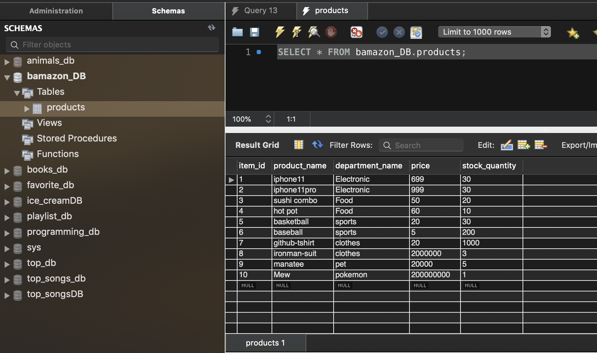
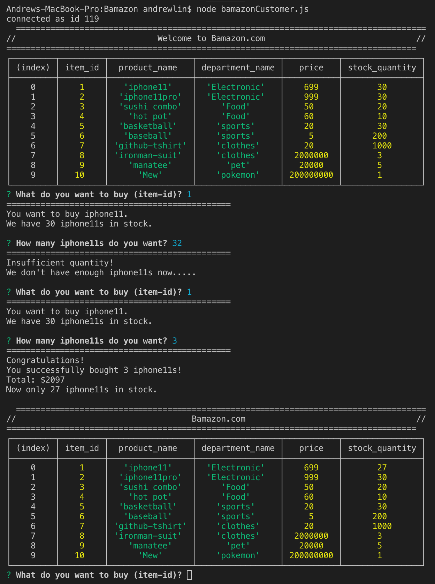
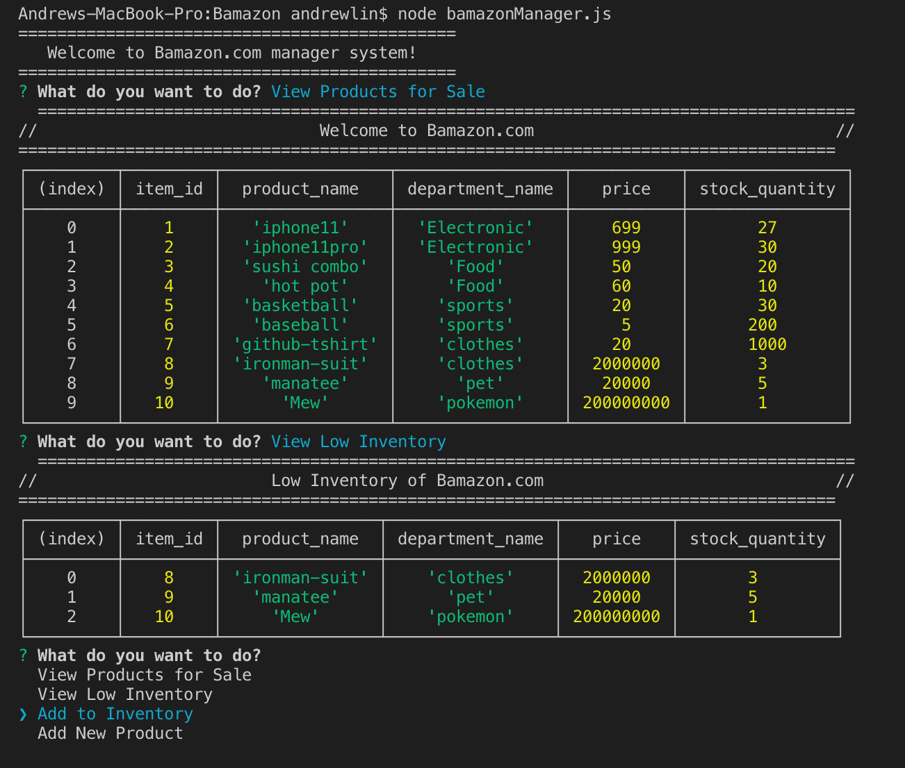
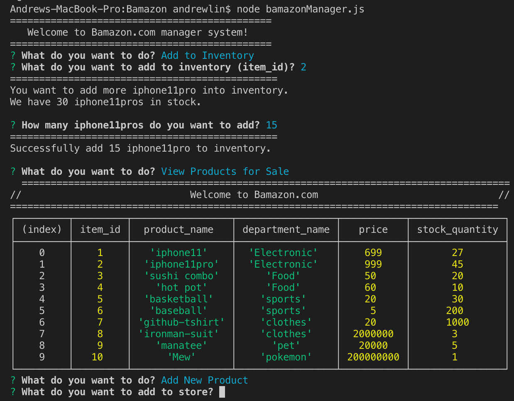
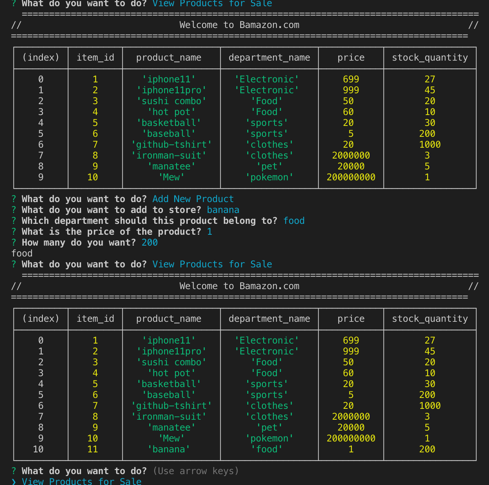

# Bamazon

check screenshots folder for screenshots

1. Successfully built the database;

------------------------------------------------------------

2. bamazonCustomer.js is working fine;

------------------------------------------------------------

3.4.5 bamazonManager.js is working fine;

